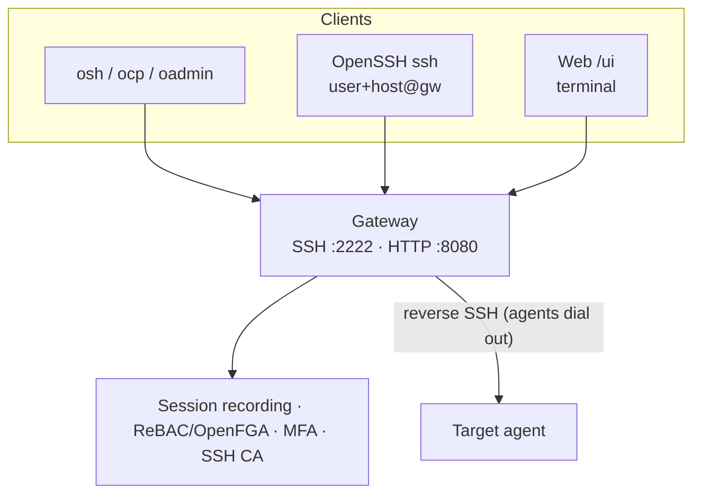

# Orion Belt

[](https://orion-belt.dev)
[](https://discord.gg/w62S8jxTHJ)
[](LICENSE)
[](go.mod)
[](https://github.com/orion-belt-dev/orion-belt/releases)
[](https://github.com/orion-belt-dev/orion-belt/actions)

**Self-hosted SSH access gateway with PAM workflows.**

Self-hosted SSH/RDP access gateway with PAM workflows, without opening inbound ports or adopting a large platform. Agents dial **out** over reverse SSH; you get session recording, live watch, JIT approvals, MFA/WebAuthn, ReBAC, and optional SSH CA.

> **v1.0.0** — stable and public. Free to self-host and use internally under [Apache 2.0 + Commons Clause](LICENSE). You cannot sell Orion Belt as a product or hosted service. Details: [orion-belt.dev](https://orion-belt.dev).


## Why Orion Belt?

| | |
| --- | --- |
| ✓ | Self-hosted — no SaaS dependency |
| ✓ | Reverse SSH agents — no inbound firewall holes on targets |
| ✓ | Session recording + live watch |
| ✓ | JIT access with approvals (UI / API / ChatOps) |
| ✓ | MFA — TOTP + WebAuthn |
| ✓ | ReBAC authorization (optional OpenFGA) |
| ✓ | Optional SSH Certificate Authority |
| ✓ | Linux packages (deb / rpm / apk) |

## Orion Belt in Action


## Try Orion Belt in 10 minutes

Goal: gateway up → agent dials out → SSH works → session recorded.

```bash
git clone https://github.com/orion-belt-dev/orion-belt.git
cd orion-belt
./scripts/docker-quickstart.sh
```

Open **http://localhost:8080/ui**, sign in with the printed `admin` username and public key, then:

1. **Add agent** in the console — save the private key as `./agent-key` (`chmod 600`)
2. Start an agent (same host is fine for a lab):

```bash
cp .env.agent.example .env.agent
# set ORION_SERVER_HOST (e.g. host.docker.internal or your LAN IP) and ORION_AGENT_NAME
docker compose -f docker-compose.agent.yml --env-file .env.agent up -d
```

3. Grant yourself access to the machine, SSH in (web terminal or `osh` / OpenSSH), then open **Sessions** to replay or live-watch.

Full walkthrough: **[Try Orion Belt in 10 minutes](docs/TRY_IN_10_MINUTES.md)**.

## Orion Belt vs alternatives

| | Orion Belt | Teleport | Boundary | Traditional bastion |
| --- | --- | --- | --- | --- |
| Scope | SSH-focused PAM / bastion | Broad zero-trust platform | Credential brokering / sessions | Jump host |
| Deploy | Self-hosted, Linux-first | Self-hosted or cloud | Self-hosted or HCP | DIY |
| Target reach | Agents dial **out** (no inbound on hosts) | Node agents / reverse tunnels | Workers / proxies | Inbound to bastion + often to hosts |
| Session recording | Yes (+ live watch) | Yes | Yes (with workers) | Usually custom / none |
| JIT approvals | Built-in (+ ChatOps) | Yes | Via workflows / IdP | Rarely |
| Weight | Lighter SSH PAM slice | Large platform | Identity-centric | Minimal features |

Pick Orion Belt when you want **SSH access management you run yourself**, without exposing SSH on every box or operating a full Teleport-scale stack.

## Features

- **Gateway** — SSH/SCP proxy with recording, ReBAC, MFA, optional SSH CA
- **Agents** — dial out over reverse SSH; no inbound holes on targets
- **Clients** — `osh` / `ocp` / `oadmin`, or vanilla OpenSSH (`user+machine@gateway`)
- **JIT access** — request → approve → time-boxed grant (UI, API, Slack/Discord/Teams/Rocket.Chat)
- **Web console** — live terminal, file browser, session playback/watch, users, machines, permissions
- **Usage analytics dashboard** — rolling access volume, approval latency, and top targets (auto-refreshing)
- **Plugins** — audit, email/webhook/Slack, ChatOps approvals — configure live from the UI
- **Ops** — Prometheus metrics, JSON logs, OpenAPI, deb/rpm/apk + GPG-signed repos

## Architecture


```mermaid
flowchart TB
  subgraph Clients
    CLI["osh / ocp / oadmin"]
    OpenSSH["OpenSSH ssh<br/>user+host@gw"]
    UI["Web /ui<br/>terminal"]
  end

  GW["Gateway<br/>SSH :2222 · HTTP :8080"]
  Rec["Session recording · ReBAC/OpenFGA · MFA · SSH CA"]
  Agent["Target agent"]

  CLI --> GW
  OpenSSH --> GW
  UI --> GW
  GW --> Rec
  GW -->|"reverse SSH (agents dial out)"| Agent
```

Details: [ARCHITECTURE.md](docs/ARCHITECTURE.md).

## Install

### Docker (fastest)

```bash
./scripts/docker-quickstart.sh
```

See [Try in 10 minutes](docs/TRY_IN_10_MINUTES.md) for agent + first session.

Step-by-step compose (secrets + admin bootstrap): same script, or the manual path in that doc. Make targets: `docker-up` / `docker-down` / `docker-agent-up`.

### Packages (deb / rpm / apk)

```bash
make packages
# then install from dist/ — see docs/PACKAGING.md
```

First-run after packages: [SETUP.md](docs/SETUP.md).

### From source

```bash
git clone https://github.com/orion-belt-dev/orion-belt.git
cd orion-belt
make build   # Go 1.26.5+ (see go.mod)
```

## Docs

| Doc | |
| --- | --- |
| [Try in 10 minutes](docs/TRY_IN_10_MINUTES.md) | Lab path to first recorded session |
| [SETUP.md](docs/SETUP.md) | Production / package first-run |
| [SSH_CA.md](docs/SSH_CA.md) | Optional certificate authority |
| [openssh-clients.md](docs/openssh-clients.md) | Vanilla `ssh` via the gateway |
| [DEPLOYMENT_HARDENING.md](docs/DEPLOYMENT_HARDENING.md) | Hardening checklist |
| [OBSERVABILITY.md](docs/OBSERVABILITY.md) | Metrics + logging |
| [OpenAPI](docs/openapi/openapi.yaml) | HTTP/WS API |
| [ROADMAP.md](docs/ROADMAP.md) | What’s next (OIDC, HA, …) |

## Security notes

- Connections use SSH; recordings can be AES-GCM encrypted at rest
- ReBAC (and optional OpenFGA) enforce per-machine access
- MFA: TOTP and/or WebAuthn; SSH supports FIDO `sk-*` keys
- Temporary access expires automatically; audit trail covers access and changes

## License

Apache License 2.0 with the [Commons Clause](https://commonsclause.com/) — see [LICENSE](LICENSE).

You may use, modify, and run Orion Belt internally (including commercially). The Clause withholds selling Orion Belt itself, or a hosted service whose value derives substantially from it, as a product.

## Contributing

Issues and PRs welcome — see [CONTRIBUTING.md](docs/CONTRIBUTING.md).

Looking for early operators (labs / small teams) willing to deploy v1.0 and give feedback? Join [Discord](https://discord.gg/w62S8jxTHJ), open a [Discussion](https://github.com/orion-belt-dev/orion-belt/discussions), or file an issue.
